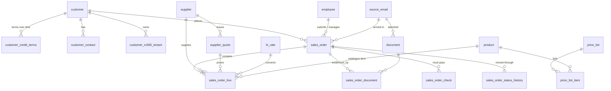
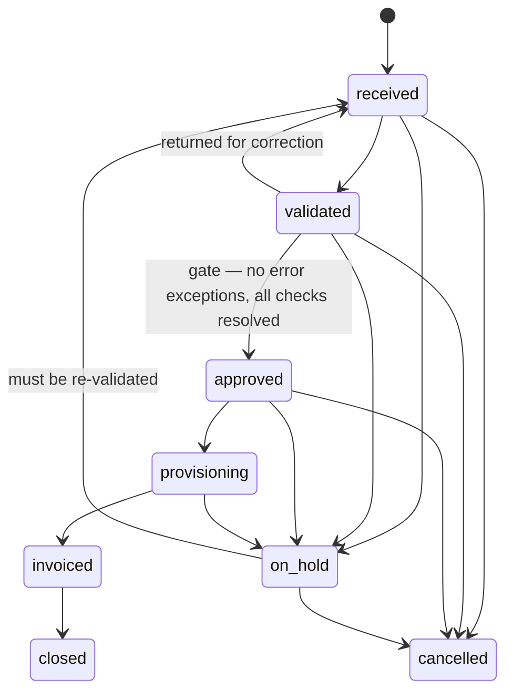

# Data model

The system of record for Managed247 sales orders. PostgreSQL 16, schema `sales`
(business data) and `audit` (change log). Source of truth is the SQL in
[`migrations/sql/`](../migrations/sql/); this page explains it.

## Entity relationships



## How the New Orders email maps to the database

Observed from real submissions to `neworders@managed.co.uk` (July–September 2026).

| In the email | Where it goes | Notes |
|---|---|---|
| Message-ID header | `source_email.internet_message_id` | **Idempotency key**: the same email can never create two orders |
| Subject, sender, received time | `source_email` | |
| "Please process this new order for – *X*" | `sales_order.title` | |
| "new" / "(additional)" | `sales_order.order_type_code` | `new`, `additional`, `renewal`, `amendment` |
| Signed Order – Attached (1) | `document` (type `signed_order`) + `sales_order_document` | File stays in SharePoint; DB holds URI + SHA-256 fingerprint |
| Customer PO ref / attachment | `sales_order.customer_po_reference` + `document` (`customer_po`) | Raises a `customer_po_received` check |
| Supplier Quote – Attached | `supplier_quote` + `document` (`supplier_quote`) | Linked per line |
| "Pricing as per Managed Service Catalogue 2026" | `sales_order.price_list_id` | Catalogue held in `price_list` / `price_list_item` |
| Billing Cycle – "Annual / Monthly" | per line: `billing_frequency_code` + `billing_periods` | See "Recurring" below |
| Direct Debit signed / GDAP completed | `sales_order_check` rows | Evidence document optional |
| Tenant ID, primary domain | `customer_m365_tenant` | Owned by the customer, referenced by the order |
| Admin contact | `customer_contact` | |
| USD rate + XE screenshot | `fx_rate` (+ `fx_evidence` document) | Lines reference the rate; nobody types a rate onto a line |
| Pricing table: SKU, Description | `sales_order_line.sku`, `.description` | SKU matched to `product` if it exists |
| QTY | `.quantity` | |
| **Recurring** | `.billing_periods` | 1 = one-off *or* a single annual period; 12 = annual commit billed monthly; 36 = 36-month term |
| Cost USD / Unit Cost | `.unit_cost_in_cost_currency` (+ `.cost_currency_code`) | GBP unit cost is **computed**: `round(cost × fx, 4)` |
| Unit Sell | `.unit_sell` | Per billing period, order currency |
| Net Cost / Net Sell / Net GM | **computed** columns `net_cost`, `net_sell`, `gross_margin` | Cannot be typed in. The emailed totals go to `stated_*` and are reconciled |
| Supplier (+ quote ref) | `.supplier_id`, `.supplier_quote_id` | Internal PS days use the `is_internal` supplier |
| "Please invoice ASAP" | `sales_order.is_expedited` | |
| "0% margin on CSP" | `sales_order.margin_exception_reason` | Required for below-policy margin |

### Arithmetic

```
unit_cost    = round(unit_cost_in_cost_currency × fx_rate, 4)
net_cost     = round(quantity × billing_periods × unit_cost, 2)
net_sell     = round(quantity × billing_periods × unit_sell, 2)
gross_margin = net_sell − net_cost
monthly recurring (views) = quantity × unit price ÷ months_per_period
```
All amounts are **net of UK VAT**; VAT is applied at invoicing (Xero).

## Workflow



From `approved` onwards, lines and commercial header fields are **locked by the database**.
Every transition is recorded in `sales_order_status_history` with who and why.

## Controls enforced by the database

| Control | Mechanism |
|---|---|
| No duplicate orders from the same email | `UNIQUE (source_email_id, source_sequence)` |
| Derived money can't be edited | `GENERATED ALWAYS` columns |
| FX rate must exist, match currencies, and is snapshotted | trigger `validate_line` |
| One-off lines have exactly one period | `CHECK` |
| Supplier quote belongs to the line's supplier | trigger `validate_line` |
| Only permitted status transitions | `order_status_transition` + trigger |
| Approval gate | trigger: blocks `approved` while error exceptions or unresolved checks exist |
| Frozen after approval | triggers `validate_line`, `lock_commercials` |
| Credit terms periods never overlap | `EXCLUDE USING gist` |
| Non-standard terms need reason + approver | `CHECK` |
| Waived checks need a note | `CHECK` |
| Full audit trail, append-only | `audit.change_log` + triggers; UPDATE/DELETE blocked |
| App cannot delete anything | role grants (`db/bootstrap/grants.sql`) |

## Exception rules (`sales.v_sales_order_exception`)

| Rule | Severity | Meaning |
|---|---|---|
| `NO_LINES` | error | Order has no lines |
| `NEGATIVE_LINE_MARGIN` | error | A line sells below cost |
| `LOW_ORDER_MARGIN` | warning | GM% below `policy_setting.min_order_gm_pct` with no `margin_exception_reason` |
| `TAX_LINE_MARKED_UP` | error | A tax pass-through line is sold at a price other than cost |
| `STATED_TOTAL_MISMATCH` | error | Emailed totals differ from computed by more than `stated_total_tolerance` |
| `MISSING_SIGNED_ORDER` | error | No signed order document linked |
| `NO_CREDIT_TERMS` | error | Customer has no terms in force on the order date |
| `CUSTOMER_CREDIT_RISK` | warning | Customer risk rating elevated/high; message states the terms to apply |
| `SUPPLIER_NOT_APPROVED` | error | A line uses a supplier without an approved account |
| `STALE_FX_RATE` | warning | FX rate older than `max_fx_rate_age_days` at receipt |
| `CHECK_FAILED` | error | A pre-processing check was recorded as failed |

Errors block approval; warnings inform. Add a rule = add one `UNION ALL` branch in a new migration.

## Conventions

- Surrogate `bigint` identity keys; readable text codes for lookups.
- Money `numeric` — never floating point, in the database *or* in Python (the input models reject floats).
- Every table: `created_at/by`, `updated_at/by`, `row_version`; all covered by the audit trigger.
- Master data (customers, suppliers, employees, FX rates) is never created implicitly by an order.
  An unknown name fails the whole load — a typo must not create a duplicate customer.
- Once a migration has run in production it is immutable; changes go in a new migration.
